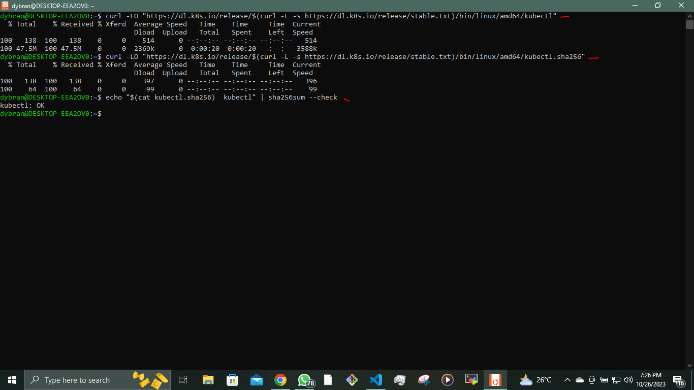

## __DEPLOYING APPLICATION INTO KUBERNETES CLUSTER__

In this project, I will initiate the deployment of applications within a Kubernetes (K8s) cluster. Kubernetes is a complex system with numerous components, working with multiple layers of abstraction that separate your application from the underlying host machines where it is executed.

we will explore and witness the following aspects in action:

- Implementing the deployment of software applications using __YAML manifest__ files, featuring various Kubernetes objects, including:
   - Pods
   - ReplicaSets
   - Deployments
   - StatefulSets
   - Services (ClusterIP, NodeIP, Loadbalancer)
   - Configmaps
   - Volumes
   - PersistentVolumes
   - PersistentVolumeClaims
   - And more.

- Understanding the distinctions between __stateful__ and __stateless__ applications.

- Demonstrating the deployment of __MySQL__ as a __StatefulSet__ and providing a rationale for this choice.

- Identifying the limitations associated with deploying applications directly using __YAML manifests__ in Kubernetes.

- Introducing __Helm templates__, exploring their components, and highlighting the significance of __semantic versioning__.

- Converting all the existing __.yaml templates__ into a Helm chart for more streamlined management.

- Deploying additional tools on AWS Elastic Kubernetes Service (EKS) using Helm charts, which include:
   - Jenkins
   - MySQL
   - Ingress Controllers (Nginx)
   - Cert-Manager
   - Ingress configurations for Jenkins and the primary application
   - Deploying Monitoring Tools, such as Prometheus and Grafana.

- Exploring the concept of Hybrid CI/CD by integrating various tools like Gitlab CI/CD and Jenkins. Additionally, we'll delve into GitOps principles using Weaveworks Flux.

When utilizing a Kubernetes cluster, the available options vary depending on its intended purpose.

Numerous organizations choose Managed Service solutions for various compelling reasons, such as:

- Less administrative overheads
- Reduced cost of ownership
- Improved Security
- Seamless support
- Periodical updates to a stable and well-tested version
- Faster cluster spin up

However, there is usually strong reasons why organisations with very strict compliance and security concerns choose to build their own Kubernetes clusters. Most of the companies that go this route will mostly use on-premises data centres. When there is need to store data privately due to its sensitive nature, companies will rather not use a public cloud provider. Because, if they do, they have no idea of the physical location of the data centre in which their data is being persisted. Banks and Governments are typical examples of this.

Some setup options can combine both public and private cloud together. For example, the master nodes, etcd clusters, and some worker nodes that run [__stateful__](https://www.techtarget.com/whatis/definition/stateful-app) applications can be configured in private datacentres, while worker nodes that require heavy computations and [__stateless__](https://www.redhat.com/en/topics/cloud-native-apps/stateful-vs-stateless) applications can run in public clouds. This kind of hybrid architecture is ideal to satisfy compliance, while also benefiting from other public cloud capabilities.


We will be using the Elastic Kubernates Service(EKS) for this project. To set up the EKS, we need to install WSL. To install WSL click [here](https://learn.microsoft.com/en-us/windows/wsl/install).

OR

Run the following to enable WSL

`dism.exe /online /enable-feature /featurename:Microsoft-Windows-Subsystem-Linux /all /norestart`


Reboot your system.  

After the reboot, open the Microsoft Store, search for your preferred Linux distribution (e.g., Ubuntu), and install it.


Complete the initial setup of the Linux distribution by creating a user and password.

Update the ubuntu packages On the WSL

`$ sudo apt update && sudo pat upgrade`


Download and install __eksctl__

`$ curl --silent --location "https://github.com/weaveworks/eksctl/releases/latest/download/eksctl_$(uname -s)_amd64.tar.gz" | tar xz -C /tmp`

Move to __/usr/local/bin__

`$ sudo mv /tmp/eksctl /usr/local/bin`

`$ eksctl version`


For the WSL to interact with the AWS we need to install __awscli__ and configure

`$ sudo apt install awscli`

`$ aws configure`


Setup __kubectl__

To setup kubectl we will refer to the [kubernetes documentation](https://kubernetes.io/docs/tasks/tools/install-kubectl-linux/#install-kubectl-binary-with-curl-on-linux).

Install kubectl

`$ curl -LO "https://dl.k8s.io/release/$(curl -L -s https://dl.k8s.io/release/stable.txt)/bin/linux/amd64/kubectl"`

Make kubectl executable

`$ sudo chmod +x kubectl`

To make kubectl globally accessible

`$ sudo mv kubectl /usr/local/bin/`

Verify

`$ kubectl version --client`




To verify run any __aws__ command

`$ aws s3 ls`

Now, you have __eksctl__ installed on your Windows system through __WSL__. You can use it to interact with Amazon EKS clusters.

```
$ eksctl create cluster \
  --name deploy \
  --version 1.23 \
  --region us-east-1 \
  --nodegroup-name workers \
  --node-type t2.micro \
  --nodes 2
```


Configure kubectl

After your cluster is created, you need to configure kubectl to connect to the cluster. Run the command

`$ aws eks --region us-east-1 update-kubeconfig --name deploy`


