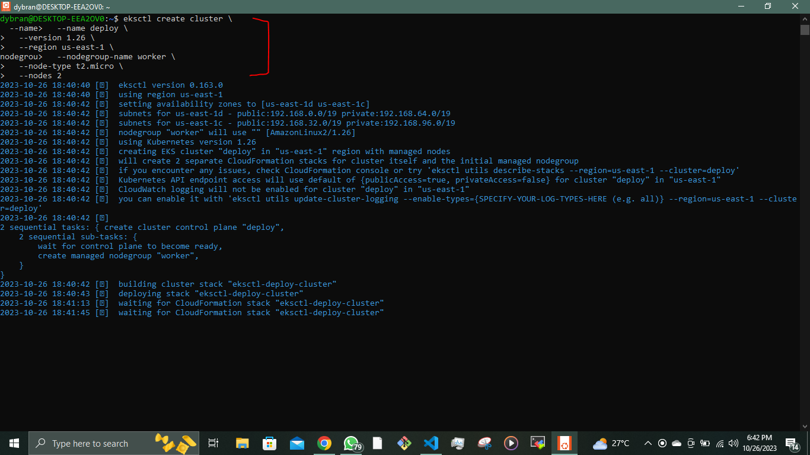

## __DEPLOYING APPLICATION INTO KUBERNETES CLUSTER__

In this project, I will initiate the deployment of applications within a Kubernetes (K8s) cluster. Kubernetes is a complex system with numerous components, working with multiple layers of abstraction that separate your application from the underlying host machines where it is executed.

we will explore and witness the following aspects in action:

- Implementing the deployment of software applications using __YAML manifest__ files, featuring various Kubernetes objects, including:
   - Pods
   - ReplicaSets
   - Deployments
   - StatefulSets
   - Services (ClusterIP, NodeIP, Loadbalancer)
   - Configmaps
   - Volumes
   - PersistentVolumes
   - PersistentVolumeClaims
   - And more.

- Understanding the distinctions between __stateful__ and __stateless__ applications.

- Demonstrating the deployment of __MySQL__ as a __StatefulSet__ and providing a rationale for this choice.

- Identifying the limitations associated with deploying applications directly using __YAML manifests__ in Kubernetes.

- Introducing __Helm templates__, exploring their components, and highlighting the significance of __semantic versioning__.

- Converting all the existing __.yaml templates__ into a Helm chart for more streamlined management.

- Deploying additional tools on AWS Elastic Kubernetes Service (EKS) using Helm charts, which include:
   - Jenkins
   - MySQL
   - Ingress Controllers (Nginx)
   - Cert-Manager
   - Ingress configurations for Jenkins and the primary application
   - Deploying Monitoring Tools, such as Prometheus and Grafana.

- Exploring the concept of Hybrid CI/CD by integrating various tools like Gitlab CI/CD and Jenkins. Additionally, we'll delve into GitOps principles using Weaveworks Flux.

When utilizing a Kubernetes cluster, the available options vary depending on its intended purpose.

Numerous organizations choose Managed Service solutions for various compelling reasons, such as:

- Less administrative overheads
- Reduced cost of ownership
- Improved Security
- Seamless support
- Periodical updates to a stable and well-tested version
- Faster cluster spin up

However, there is usually strong reasons why organisations with very strict compliance and security concerns choose to build their own Kubernetes clusters. Most of the companies that go this route will mostly use on-premises data centres. When there is need to store data privately due to its sensitive nature, companies will rather not use a public cloud provider. Because, if they do, they have no idea of the physical location of the data centre in which their data is being persisted. Banks and Governments are typical examples of this.

Some setup options can combine both public and private cloud together. For example, the master nodes, etcd clusters, and some worker nodes that run [__stateful__](https://www.techtarget.com/whatis/definition/stateful-app) applications can be configured in private datacentres, while worker nodes that require heavy computations and [__stateless__](https://www.redhat.com/en/topics/cloud-native-apps/stateful-vs-stateless) applications can run in public clouds. This kind of hybrid architecture is ideal to satisfy compliance, while also benefiting from other public cloud capabilities.


We will be using the Elastic Kubernates Service(EKS) for this project. To set up the EKS, we need to install WSL. To install WSL click [here](https://learn.microsoft.com/en-us/windows/wsl/install).

OR

Run the following to enable WSL

`dism.exe /online /enable-feature /featurename:Microsoft-Windows-Subsystem-Linux /all /norestart`


Reboot your system.  

After the reboot, open the Microsoft Store, search for your preferred Linux distribution (e.g., Ubuntu), and install it.


Complete the initial setup of the Linux distribution by creating a user and password.

Update the ubuntu packages On the WSL

`$ sudo apt update && sudo pat upgrade`


Download and install __eksctl__

`$ curl --silent --location "https://github.com/weaveworks/eksctl/releases/latest/download/eksctl_$(uname -s)_amd64.tar.gz" | tar xz -C /tmp`

Move to __/usr/local/bin__

`$ sudo mv /tmp/eksctl /usr/local/bin`

`$ eksctl version`


For the WSL to interact with the AWS we need to install __awscli__ and configure

`$ sudo apt install awscli`

`$ aws configure`

Install __pip__

`$ sudo apt install python3-pip`

Upgrade the __awscli__

`$ pip install --upgrade awscli`


To verify run any __aws__ command

`$ aws s3 ls`

Setup __kubectl__

To setup kubectl we will refer to the [kubernetes documentation](https://kubernetes.io/docs/tasks/tools/install-kubectl-linux/#install-kubectl-binary-with-curl-on-linux).

Install kubectl

`$ curl -LO "https://dl.k8s.io/release/$(curl -L -s https://dl.k8s.io/release/stable.txt)/bin/linux/amd64/kubectl"`

Download the kubectl checksum file

`$ curl -LO "https://dl.k8s.io/release/$(curl -L -s https://dl.k8s.io/release/stable.txt)/bin/linux/amd64/kubectl.sha256"`

Validate the kubectl binary against the checksum file

`$ echo "$(cat kubectl.sha256)  kubectl" | sha256sum --check`

Install kubectl

`$ sudo install -o root -g root -m 0755 kubectl /usr/local/bin/kubectl`

Verify

`$ kubectl version --client`


Now, you have __eksctl__ installed on your Windows system through __WSL__. You can use it to interact with Amazon EKS clusters.

```
$ eksctl create cluster \
  --name deploy \
  --region us-east-1 \
  --nodegroup-name worker \
  --node-type t2.micro \
  --nodes 2
```


__Configure kubectl__

After the cluster is created, you need to configure kubectl to connect to the cluster. Run the command

`$ aws eks --region us-east-1 update-kubeconfig --name deploy`

Then run to get nodes

`$ kubectl get nodes`


__Creating A Pod For The Nginx Application__


Create nginx pod by applying the manifest file
__nginx-pod.yml__ manifest file shown below

```
apiVersion: v1
kind: Pod
metadata:
  name: nginx-pod
  labels: 
    app: nginx-pod
spec:
  containers:
  - image: nginx:latest
    name: nginx-pod
    ports:
    - containerPort: 80
      protocol: TCP
```
Create the pods

`$ kubectl apply -f nginx-pod.yml`

We can access the pod using

`$ kubectl get pod nginx-pod.yml`

To access the information about the pod

`$ kubectl describe pod nginx-pod.yml`


__ACCESSING THE APP FROM THE BROWSER__

The primary objective of any solution is to enable access through either a web portal or an application, such as a mobile app. In our current setup, we have a Pod equipped with an Nginx container. However, this Pod can't be accessed directly from a web browser due to its unique IP address.

To resolve this issue, we introduce another Kubernetes component known as a "Service." 

A Service acts as an intermediary that receives requests and forwards them to the respective Pod's IP address.

In essence, a Service acts as a gateway that accepts incoming requests on behalf of the Pods and routes them to the appropriate Pod's IP address. If you execute the provided command, you can obtain the IP address of the Pod. Nonetheless, it's important to note that there is no direct means of accessing this Pod from the external world.

`$ kubectl get pod nginx-pod  -o wide`


__Expose a Service on a server’s public IP address & static port__

Sometimes, it may be needed to directly access the application using the public IP of the server (when we speak of a K8s cluster we can replace ‘server’ with ‘node’) the Pod is running on. This is when the NodePort service type comes in handy.

A Node port service type exposes the service on a static port on the node’s IP address. NodePorts are in the __30000-32767__ range by default, which means a NodePort is unlikely to match a service’s intended port (for example, 80 may be exposed as 30080).


Create a Service - __nginx-svc.yml__ manifest file

```
apiVersion: v1
kind: Service
metadata:
  name: nginx-service
spec:
  type: NodePort
  selector:
    app: nginx-pod
  ports:
    - protocol: TCP
      port: 80
      nodePort: 30080
```

Cretae the service

`$ kubectl apply -f nginx-svc.yml`

We can access the svc using

`$ kubectl get svc -o wide`

To access the information about the service

`$ kubectl describe svc nginx-svc.yml`


To access the service,

Allow the inbound traffic in your EC2’s Security Group to the NodePort range __30080__


Access the nginx using the public IP address of the node the Pod is running on


The port number __30080__ designates the specific port associated with the node where the Pod is currently scheduled to operate. Should the Pod undergo rescheduling to a different node, it will retain this very port number on its new hosting node. Consequently, if you have multiple Pods concurrently running on diverse nodes, each of them will be accessible via their respective node IP addresses, all employing the same consistent port number.

__CREATE A REPLICA SET__

Let us create a __rs.yaml__ manifest for a ReplicaSet object

```
apiVersion: apps/v1
kind: ReplicaSet
metadata:
  name: nginx-rs
  labels:
    app: nginx-pod
    tier: frontend
spec:
  replicas: 2
  selector:
    matchLabels:
      tier: frontend
  template:
    metadata:
      name: nginx-pod
      labels:
         app: nginx-pod
         tier: frontend
    spec:
      containers:
      - image: nginx:latest
        name: nginx-pod
        ports:
        - containerPort: 80
          protocol: TCP
```


__PROBLEMS ENCOUNTERED__

Could not connect to the kubernetes api server using

`aws eks --region us-east-1 update-kubeconfig --name deploy`. 

I had to upgrade the __awscli__ to version __1.29__ using 

`$ pip install --upgrade awscli`


